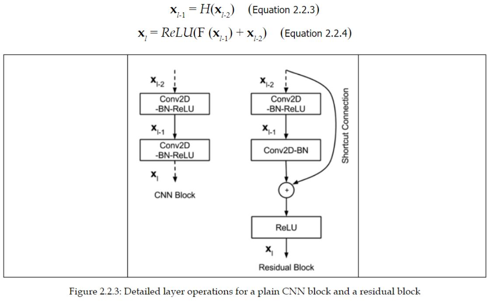

Tensorflow 2 Implementation of  
## [Deep Residual Learning for Image Recognition](https://arxiv.org/abs/1512.03385)  

### Introduction :  
It is found that it's not easy to train deep networks because the gradient may vanish (or explode) with depth in the shallow layers during backpropagation. 

The idea of ResNet is that; in order to prevent the gradient from degrading, we let the information flow through a shortcut connections to reach the shallow layers. 

